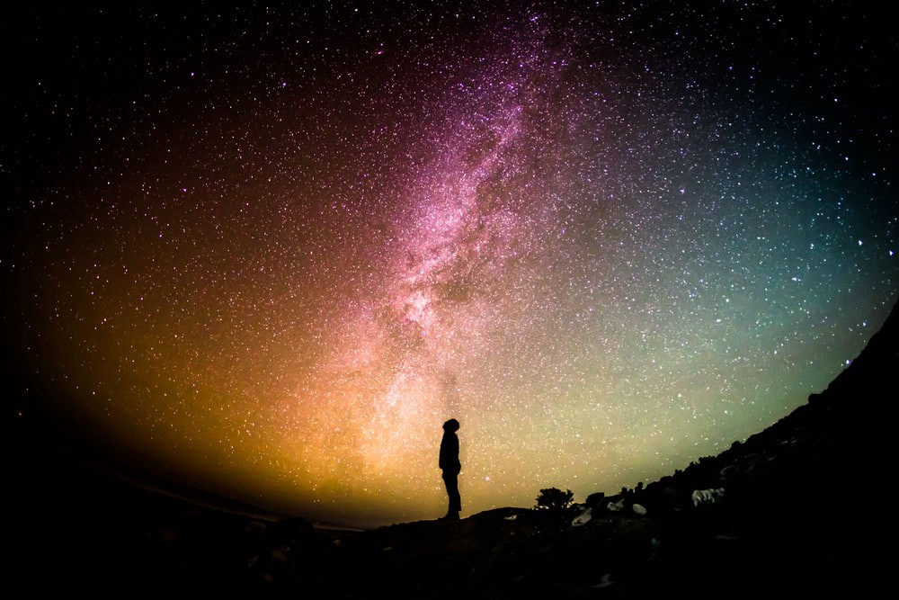

# Astrophysics and Kisses

We were two heavenly bodies  
From distant faraway galaxies,  
Acquainted by happenstance, unimaginable,  
Even in this realm of endless possibilities.

Ours was a perfectly inelastic collision  
That defied both logic and reason.  
Creating a void that imprisoned all light,  
Robbing us of every sensation.

You see, where your lips meet mine,  
Shall be a point of infinite gravity.  
At least, that’s how it’ll feel -  
Our kiss — _a singularity._

