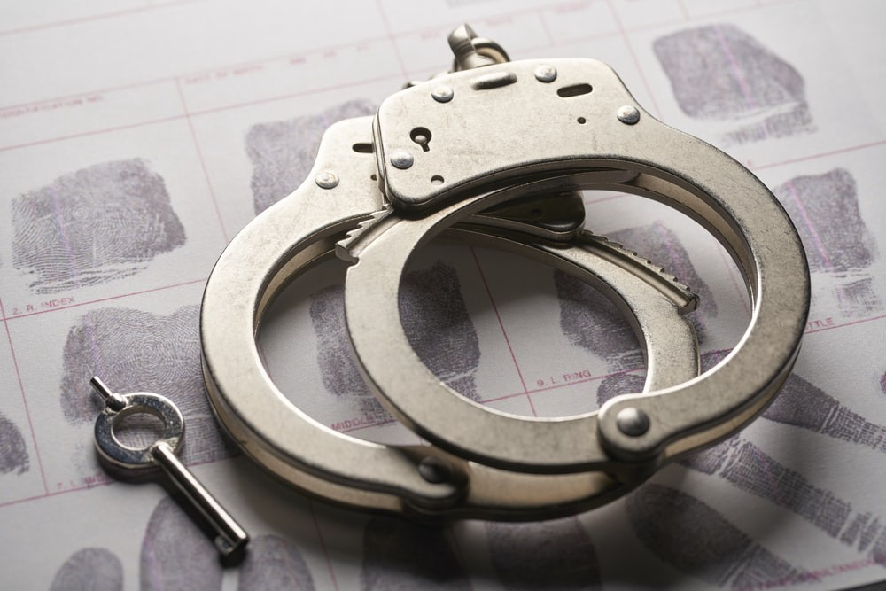

# We'll Never Use Miranda Rights

Poetry is a lot like a person,  
And maaan, am I really bad poetry.  
For starters, I’m guilty of **Arson**,  
Burning bridges, making enemies.

When I took your brain_child_,  
And got charged with **Kidnapping**.  
I couldn't help it, I cried -  
- “No one could resist such beautiful writing”

The only thing I can share with you are words,  
So I’m sorry for making you an accessory to felony.  
But might as well try for there's nothing to lose  
I have this proposal, I hope you agree.

I’ll be yours, and you’ll be mine.  
On a quest for Wordly mayhem -  
- Making poems without rhyme,  
Murdering grammar to spite them.

The cops will chase us  
But they’ll never catch up  
Let’s be partners in crime,  
And we’ll be _writing in tandem._

